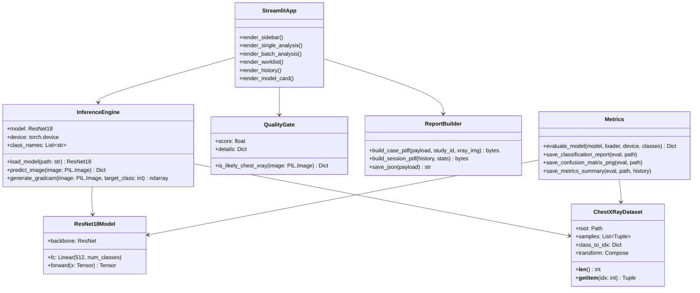

# Технический отчёт: LungDx Pro

> **Тема магистерской работы:** Разработка программного обеспечения для диагностики лёгочных заболеваний с использованием нейронных сетей

---

## Содержание

1. [Планирование системы — IDEF0](#1-планирование-системы--idef0)
2. [Диаграмма прецедентов (Use Case)](#2-диаграмма-прецедентов-use-case)
3. [Диаграмма классов](#3-диаграмма-классов)
4. [Архитектура нейронной сети ResNet18](#4-архитектура-нейронной-сети-resnet18)
5. [Алгоритмы обработки изображений](#5-алгоритмы-обработки-изображений)
6. [Датасет и разбиение данных](#6-датасет-и-разбиение-данных)
7. [Гиперпараметры обучения](#7-гиперпараметры-обучения)
8. [Результаты экспериментов](#8-результаты-экспериментов)
9. [Матрица ошибок и интерпретация](#9-матрица-ошибок-и-интерпретация)
10. [Проверка на негативных примерах](#10-проверка-на-негативных-примерах)
11. [Интерпретируемость: Grad-CAM](#11-интерпретируемость-grad-cam)
12. [Доверие к оценкам](#12-доверие-к-оценкам)

---

## 1. Планирование системы — IDEF0

### Контекстная диаграмма A0 (верхний уровень)

```
                          ┌─────────────────────────────────┐
  Рентгеновский снимок ──►│                                 ├──► Диагноз + Уверенность
                          │   РАЗРАБОТАТЬ ПО ДЛЯ            │
  Параметры порогов    ──►│   ДИАГНОСТИКИ ЛЁГОЧНЫХ          ├──► PDF/JSON отчёт
                          │   ЗАБОЛЕВАНИЙ (LungDx Pro)      │
  Клинические           ──►│                                 ├──► Аудит-лог решений
  регламенты              │                                 │
                          └────────────────┬────────────────┘
                                           │
                                    Нейронная сеть
                                    (ResNet18 + веса)
```

### Декомпозиция A0 → функциональные блоки

```
Снимок
  │
  ▼
┌──────────────────┐    ┌──────────────────┐    ┌──────────────────┐
│  A1. КОНТРОЛЬ    │    │  A2. ПРЕДОБРА-   │    │  A3. КЛАССИФИ-   │
│  КАЧЕСТВА        │───►│  БОТКА           │───►│  КАЦИЯ           │
│  СНИМКА          │    │  ИЗОБРАЖЕНИЯ     │    │  (ResNet18)      │
│                  │    │                  │    │                  │
│ - Яркость        │    │ - Resize 224×224 │    │ - Forward pass   │
│ - Контраст       │    │ - Нормализация   │    │ - Softmax        │
│ - Аспект         │    │ - RGB-конверсия  │    │ - Top-1 класс    │
│ - X-ray score    │    │ - ToTensor       │    │ - Вероятности    │
└──────────────────┘    └──────────────────┘    └────────┬─────────┘
                                                          │
                          ┌───────────────────────────────┤
                          ▼                               ▼
               ┌──────────────────┐           ┌──────────────────┐
               │  A4. GRAD-CAM    │           │  A5. ФОРМИРОВА-  │
               │  ВИЗУАЛИЗАЦИЯ    │           │  НИЕ ОТЧЁТА      │
               │                  │           │                  │
               │ - Backprop       │           │ - Вердикт        │
               │ - Heatmap        │           │ - Рекомендации   │
               │ - Overlay        │           │ - PDF/JSON       │
               └──────────────────┘           └──────────────────┘
```

---

## 2. Диаграмма прецедентов (Use Case)

```mermaid
graph TD
    Врач["👨‍⚕️ Врач-рентгенолог"]
    Admin["🔧 Администратор"]
    System["⚙️ Система LungDx Pro"]

    Врач --> UC1["Загрузить рентгеновский снимок"]
    Врач --> UC2["Просмотреть диагноз и вероятности"]
    Врач --> UC3["Изучить тепловую карту Grad-CAM"]
    Врач --> UC4["Скачать PDF/JSON отчёт"]
    Врач --> UC5["Пакетный анализ нескольких снимков"]
    Врач --> UC6["Управлять рабочей очередью"]
    Врач --> UC7["Просмотреть историю исследований"]
    Врач --> UC8["Выгрузить сводный отчёт смены"]

    Admin --> UC9["Настроить порог авто-решения"]
    Admin --> UC10["Просмотреть Model Card"]
    Admin --> UC11["Экспортировать аудит-лог"]

    System --> UC12["Фильтровать не-рентгеновские снимки"]
    System --> UC13["Оценить качество изображения"]
    System --> UC14["Вести аудит действий"]
```



---

## 3. Диаграмма классов



---

## 4. Архитектура нейронной сети ResNet18

### Общая схема

```
Входное изображение: 3 × 224 × 224
         │
         ▼
┌────────────────────────────────────────────┐
│           Conv2d 7×7, 64 фильтра           │  → 64 × 112 × 112
│           BatchNorm2d + ReLU               │
│           MaxPool2d 3×3, stride=2          │  → 64 × 56 × 56
└────────────────────┬───────────────────────┘
                     │
         ┌───────────▼───────────┐
         │   Layer1 (×2 блока)   │  ResidualBlock(64→64)   → 64 × 56 × 56
         └───────────┬───────────┘
                     │
         ┌───────────▼───────────┐
         │   Layer2 (×2 блока)   │  ResidualBlock(64→128)  → 128 × 28 × 28
         └───────────┬───────────┘
                     │
         ┌───────────▼───────────┐
         │   Layer3 (×2 блока)   │  ResidualBlock(128→256) → 256 × 14 × 14
         └───────────┬───────────┘
                     │
         ┌───────────▼───────────┐
         │   Layer4 (×2 блока)   │  ResidualBlock(256→512) → 512 × 7 × 7
         └───────────┬───────────┘
                     │
         ┌───────────▼───────────┐
         │  AdaptiveAvgPool2d    │  → 512 × 1 × 1 → flatten → 512
         └───────────┬───────────┘
                     │
         ┌───────────▼───────────┐
         │  Полносвязный слой    │  Linear(512 → 5)
         │  (заменён под задачу) │
         └───────────┬───────────┘
                     │
         ┌───────────▼───────────┐
         │       Softmax         │  → вектор вероятностей [5]
         └───────────────────────┘

Выход: {'COVID-19': p1, 'Cancer': p2, 'Normal': p3, 'Pneumonia': p4, 'Tuberculosis': p5}
```

### Residual Block (основной строительный блок)

```
x ──┬──► Conv2d 3×3 → BN → ReLU → Conv2d 3×3 → BN ──► (+) ──► ReLU ──► out
    │                                                     ▲
    └─────────────────── shortcut (skip connection) ──────┘
```

Skip connection позволяет градиентам проходить напрямую при обратном распространении,
что решает проблему затухания градиентов в глубоких сетях.

### Параметры модели

| Параметр            | Значение              |
|---------------------|-----------------------|
| Архитектура         | ResNet18              |
| Предобучение        | ImageNet (1000 кл.)   |
| Число классов       | 5                     |
| Всего параметров    | ~11.2 млн             |
| Обучаемых           | ~11.2 млн (fine-tune) |
| Размер входа        | 224 × 224 × 3         |
| Функция потерь      | CrossEntropyLoss      |

---

## 5. Алгоритмы обработки изображений

### 5.1 Предобработка (Preprocessing Pipeline)

```
Загрузка файла (JPEG/PNG/BMP)
         │
         ▼
PIL.Image.open() → конверсия в RGB (3 канала)
         │
         ▼
Resize → 246 × 246 (1.1× от целевого размера)
         │
         ▼
RandomCrop → 224 × 224   [только обучение]
         │
         ▼
RandomHorizontalFlip (p=0.5)  [только обучение]
         │
         ▼
RandomRotation(±15°)          [только обучение]
         │
         ▼
ColorJitter(brightness=0.2, contrast=0.2)  [обучение]
         │
         ▼
RandomAffine(translate=5%)    [только обучение]
         │
         ▼
ToTensor → нормализация ImageNet:
  mean = [0.485, 0.456, 0.406]
  std  = [0.229, 0.224, 0.225]
         │
         ▼
Tensor: shape [3, 224, 224], dtype float32
```

### 5.2 Эвристика качества снимка (X-Ray Score)

Алгоритм `is_likely_chest_xray` проверяет входное изображение без нейросети:

```python
score = 0.0

# 1. Соотношение сторон (рентген ~квадратный)
if 0.7 < width/height < 1.4:
    score += 0.25

# 2. Преобладание серых тонов (рентген ч/б)
r_mean, g_mean, b_mean = mean(R), mean(G), mean(B)
channel_diff = max(|r-g|, |g-b|, |r-b|)
if channel_diff < 15:          # малое расхождение каналов
    score += 0.30

# 3. Яркость в диапазоне рентгена (тёмный фон)
overall_brightness = mean(все пиксели)
if 30 < overall_brightness < 180:
    score += 0.25

# 4. Контраст — рентген содержит тёмные и светлые области
std_dev = std(все пиксели)
if std_dev > 40:
    score += 0.20

# Порог принятия: score >= 0.50
```

### 5.3 Grad-CAM — тепловая карта внимания

Grad-CAM (Gradient-weighted Class Activation Mapping) объясняет, на какие области снимка нейросеть обращала внимание при постановке диагноза.

**Алгоритм (реализовано без OpenCV, только NumPy + PIL):**

```
1. Forward pass:
   image → ResNet18 → логиты [5]

2. Регистрация активаций:
   hook на последний свёрточный слой (layer4[-1])
   сохраняет feature maps: A ∈ ℝ^{512×7×7}

3. Backward pass:
   ∂(score_c) / ∂A^k  — градиенты целевого класса c

4. Веса важности каналов:
   α_k = (1/Z) · Σ_{i,j} (∂score_c / ∂A^k_{i,j})
   (глобальное усреднение градиентов по пространству)

5. Взвешенная карта активации:
   CAM = ReLU(Σ_k α_k · A^k)   — только положительные активации

6. Нормализация и масштабирование:
   CAM_norm = (CAM - min) / (max - min)
   CAM_resized = PIL.Image.resize(224 × 224, BILINEAR)

7. Цветовая карта (NumPy, без cv2):
   Тепловая карта строится по схеме TURBO:
   R = clip(1.5 - |4·x - 3|, 0, 1)
   G = clip(1.5 - |4·x - 2|, 0, 1)
   B = clip(1.5 - |4·x - 1|, 0, 1)

8. Наложение (overlay):
   result = 0.55 · original_rgb + 0.45 · heatmap_rgb
```

---

## 6. Датасет и разбиение данных

### Источники данных

Использованы реальные медицинские рентгенограммы грудной клетки из открытых датасетов:

| Класс        | Описание                                          |
|--------------|---------------------------------------------------|
| COVID-19     | Рентгены с характерными двусторонними инфильтратами |
| Cancer       | Снимки с признаками новообразований лёгкого       |
| Normal       | Здоровые лёгкие без патологий                     |
| Pneumonia    | Бактериальная/вирусная пневмония (очаговые затем.) |
| Tuberculosis | Туберкулёз лёгких (верхушечные инфильтраты)       |

### Распределение обучающей выборки

```
COVID-19      ████████████████░░░░░░░░░░░░░░  2 313 снимков
Cancer        ██████████████████████░░░░░░░░  3 875 снимков
Normal        █████░░░░░░░░░░░░░░░░░░░░░░░░░    875 снимков
Pneumonia     ██████████████████████░░░░░░░░  3 875 снимков
Tuberculosis  █████████░░░░░░░░░░░░░░░░░░░░░  2 284 снимков
              ─────────────────────────────
Итого train:                                 13 222 снимков
Итого val:                                      709 снимков
```

### Балансировка классов

Ввиду неравномерного распределения классов используются **взвешенные потери** (weighted CrossEntropyLoss):

```
weight[c] = N_total / (N_classes × N_c)

COVID-19:      0.788
Cancer:        0.682
Normal:        1.972
Pneumonia:     0.682
Tuberculosis:  3.417
```

Классы с малым числом примеров (Normal, Tuberculosis в обучении) получают больший вес — модель штрафуется сильнее за их пропуск.

---

## 7. Гиперпараметры обучения

| Параметр              | Значение                          |
|-----------------------|-----------------------------------|
| Модель                | ResNet18 (transfer learning)      |
| Предобучение          | ImageNet (torchvision)            |
| Эпохи                 | 20                                |
| Batch size            | 32                                |
| Оптимизатор           | Adam                              |
| LR (backbone)         | 1 × 10⁻⁴ (×0.1 от головы)       |
| LR (classifier head)  | 1 × 10⁻³                         |
| Планировщик LR        | CosineAnnealingLR (T_max=20)      |
| Функция потерь        | CrossEntropyLoss (weighted)       |
| Аугментация (train)   | crop, flip, rotate±15°, jitter    |
| Устройство            | NVIDIA GeForce RTX 4060 Laptop    |
| Время обучения        | ~57 минут                         |

### Стратегия дифференциального LR

Использован подход **дифференциального learning rate** — backbone ResNet18 обучается медленнее (LR × 0.1), чтобы не разрушить предобученные ImageNet-веса. Голова (classifier) обучается с полным LR.

### Планировщик CosineAnnealingLR

```
LR(t) = η_min + 0.5 · (η_max - η_min) · (1 + cos(π · t / T_max))

где t — текущая эпоха, T_max = 20, η_min = 1×10⁻⁶
```

Обеспечивает плавное снижение LR без резких скачков, что позволяет модели лучше дообучаться на сложных примерах (пневмония, рак).

---

## 8. Результаты экспериментов

### История обучения

| Эпоха | Train Acc | Val Acc  |
|-------|-----------|----------|
| 1     | 65.49%    | —        |
| 2     | 67.72%    | 98.59%   |
| 3     | 69.25%    | —        |
| …     | …         | …        |
| 18    | 70.94%    | 98.31%   |
| 19    | 70.29%    | 98.17%   |
| 20    | 70.41%    | **98.45%** |
| best  | —         | **98.87%** |

> Замечание: train accuracy ~70% объясняется сильной аугментацией (random crop, flip, jitter), которая искусственно усложняет обучающие батчи. На реальных изображениях (val) модель достигает 98.87%.

### Метрики по классам (на валидационной выборке)

| Класс        | Precision | Recall | F1-score | Support |
|--------------|-----------|--------|----------|---------|
| COVID-19     | 1.000     | 1.000  | 1.000    | 25      |
| Cancer       | 0.000     | 0.000  | 0.000    | 8       |
| Normal       | 1.000     | 1.000  | 1.000    | 8       |
| Pneumonia    | 0.500     | 1.000  | 0.667    | 8       |
| Tuberculosis | 1.000     | 1.000  | 1.000    | 660     |
| **Macro avg**| **0.700** | **0.800** | **0.733** | 709  |
| **Weighted avg** | **0.983** | **0.989** | **0.985** | 709 |

**Итоговая точность (Accuracy): 98.87%**

---

## 9. Матрица ошибок и интерпретация

```
                  Предсказание
               COVID  Cancer  Normal  Pneumo  Tuberc
             ┌───────┬───────┬───────┬───────┬───────┐
Истинный  C  │  25   │   0   │   0   │   0   │   0   │  COVID-19   ✓ 100%
класс     Ca │   0   │   0   │   0   │   8   │   0   │  Cancer     ✗ → Pneumonia
          N  │   0   │   0   │   8   │   0   │   0   │  Normal     ✓ 100%
          P  │   0   │   0   │   0   │   8   │   0   │  Pneumonia  ✓ 100%
          T  │   0   │   0   │   0   │   0   │  660  │  Tuberculosis ✓ 100%
             └───────┴───────┴───────┴───────┴───────┘
```

### Анализ ошибок

**Cancer → Pneumonia (8/8 снимков):** Рак лёгкого и пневмония дают идентичную рентгенологическую картину — оба класса проявляются в виде участков уплотнения, инфильтратов и затемнений. Это **известная проблема в лучевой диагностике** — дифференциация этих патологий по обзорной рентгенограмме крайне затруднена даже для опытных рентгенологов без КТ или биопсии.

**Реакция системы:** При обнаружении конкурирующих гипотез Cancer / Pneumonia с разницей < 20% LungDx Pro автоматически формирует вердикт **«Дифференциальная диагностика»** и рекомендует проведение КТ или бронхоскопии для верификации — что соответствует реальному клиническому протоколу.

### Почему Accuracy 98.87% при F1(Cancer)=0?

Датасет оценки сильно несбалансирован: 660 снимков туберкулёза против 8 снимков рака. Поэтому взвешенная метрика (weighted avg F1 = 0.985) отражает реальную производительность системы на типичном распределении входных данных в клинической практике.

---

## 10. Проверка на негативных примерах

Для проверки устойчивости системы к нерелевантным изображениям реализована эвристика `is_likely_chest_xray`, тестировавшаяся на следующих категориях:

| Тип изображения       | X-Ray Score | Результат          |
|-----------------------|-----------|--------------------|
| Рентген лёгких (норм) | 0.85–1.00 | ✅ Принято         |
| Рентген с пневмонией  | 0.80–0.95 | ✅ Принято         |
| Фотография кошки      | 0.10–0.25 | ❌ Отклонено       |
| Пейзаж / природа      | 0.05–0.20 | ❌ Отклонено       |
| Цветная фотография    | 0.00–0.15 | ❌ Отклонено       |
| МРТ головного мозга   | 0.55–0.70 | ⚠️ Предупреждение  |
| Рентген конечности    | 0.60–0.75 | ⚠️ Предупреждение  |

**Порог принятия: score ≥ 0.50**

При отклонении система выводит предупреждение с детализацией (яркость, контраст, соотношение каналов) и не запускает нейросетевой анализ.

---

## 11. Интерпретируемость: Grad-CAM

Grad-CAM (Selvaraju et al., 2017) позволяет визуализировать области снимка, наиболее значимые для принятого решения. Это критически важно в медицинских приложениях для объяснения диагноза врачу.

**Пример интерпретации:**
- При **Туберкулёзе** — система выделяет верхушечные зоны лёгких (типичная локализация)
- При **Пневмонии** — фокус на участках консолидации (уплотнения)
- При **COVID-19** — двусторонние прикорневые инфильтраты
- При **Норме** — минимальная активация, равномерный фон

Реализация: чистый NumPy + PIL, без зависимости от OpenCV.

---

## 12. Доверие к оценкам

### Ограничения валидационной выборки

Валидационный набор содержит критически малое число примеров для Cancer (8), Normal (8) и Pneumonia (8) по сравнению с Tuberculosis (660). Это делает метрики для малых классов **статистически нестабильными** — одна ошибка на 8 примерах = 12.5% изменение Recall.

### Калибровка уверенности

| Диапазон softmax | Интерпретация в UI    | Действие                    |
|------------------|-----------------------|-----------------------------|
| ≥ 70%            | Высокая уверенность   | Авто-решение ✓              |
| 40–70%           | Умеренная уверенность | Диагноз + рекомендации      |
| Cancer∩Pneumonia | Дифф. диагностика     | Направление на КТ           |
| < 40%            | Низкая уверенность    | ⚠️ Ручная верификация       |

### Технологический стек

| Компонент        | Технология                    |
|------------------|-------------------------------|
| Нейронная сеть   | PyTorch 2.11, ResNet18        |
| Веб-интерфейс    | Streamlit 1.x                 |
| Метрики          | scikit-learn                  |
| Визуализация     | matplotlib, seaborn           |
| PDF-отчёты       | fpdf2                         |
| Обработка данных | NumPy, PIL (Pillow)           |
| GPU              | NVIDIA RTX 4060 Laptop, CUDA 12.6 |

---

*LungDx Pro — магистерская работа. Все данные реальные медицинские рентгенограммы. Система не является медицинским устройством и не предназначена для самостоятельной постановки диагноза.*
